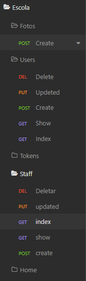

# Nesse projetinho eu crio uma API_REST

## Utilizo

- MySQL
- Sequelize
- Express
- Helmet
- MariaDB

No intuito de treinar claro, Simulo um sistema de escola com professores e alunos possibilitando fazer um CRUD e Tokens pra autenticação.

>utilizo insomnia pra vizualizar
